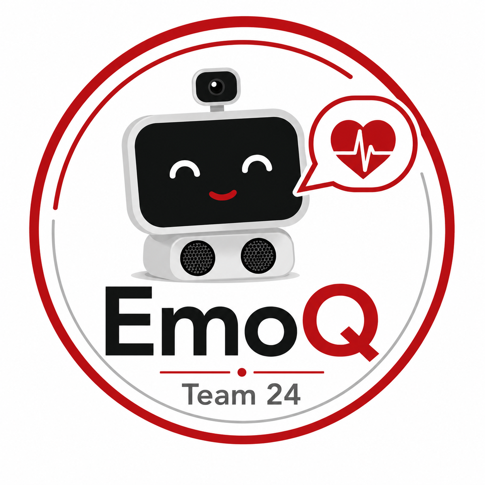

<h1>
  EmoQ: A Multimodal Emotional Companion Robot
  
</h1>

**Senior Design Project | Boston University**

EmoQ is a desktop emotional companion robot designed to provide personalized and empathetic interactions for older adults. The system combines facial recognition, facial emotion detection, speech emotion analysis, and AI-generated responses to create a more natural and emotionally aware human-robot interaction experience.

This repository contains project documentation, system overview, demo videos, testing results, and implementation materials for the EmoQ senior design project.

<p align="center">
  
</p>

---

## Project Overview

Loneliness and emotional isolation are common challenges among older adults, especially for those who live alone or have limited daily social interaction. While many existing companion devices provide basic voice interaction or reminder functions, they often lack emotional understanding and personalized responses.

EmoQ aims to address this gap by building a small desktop robot that can:

- Recognize familiar users
- Detect emotional cues from both facial expressions and speech
- Generate personalized responses through an AI response module
- Provide a more supportive and human-like interaction experience

The goal of EmoQ is not to replace human companionship, but to create a supportive daily interaction tool that can respond with emotional awareness and personalization.

---

## Demo Video

The following video demonstrates the EmoQ senior design prototype, including the robot’s interaction flow, multimodal emotion detection, AI-generated response, and physical system integration.

[Watch the EmoQ Demo Video](https://youtu.be/YjXM8wazJZY)

---

## Key Features

### 1. Face Recognition

EmoQ can identify a known user through a camera-based facial recognition module. This allows the robot to personalize its responses based on the user’s identity.

### 2. Facial Emotion Detection

The robot analyzes facial expressions to estimate the user’s emotional state, such as happiness, sadness, neutrality, or stress-related expressions.

### 3. Speech Emotion Detection

EmoQ also processes the user’s voice to identify emotional tone. Audio features such as MFCCs are used to support speech-based emotion classification.

### 4. Multimodal Emotion Fusion

Instead of relying on only one signal, EmoQ combines visual and audio emotion information to improve emotional understanding.

A simplified fusion logic can be represented as:

```math
p^{(f)} = \lambda p^{(a)} + (1-\lambda)p^{(v)}
